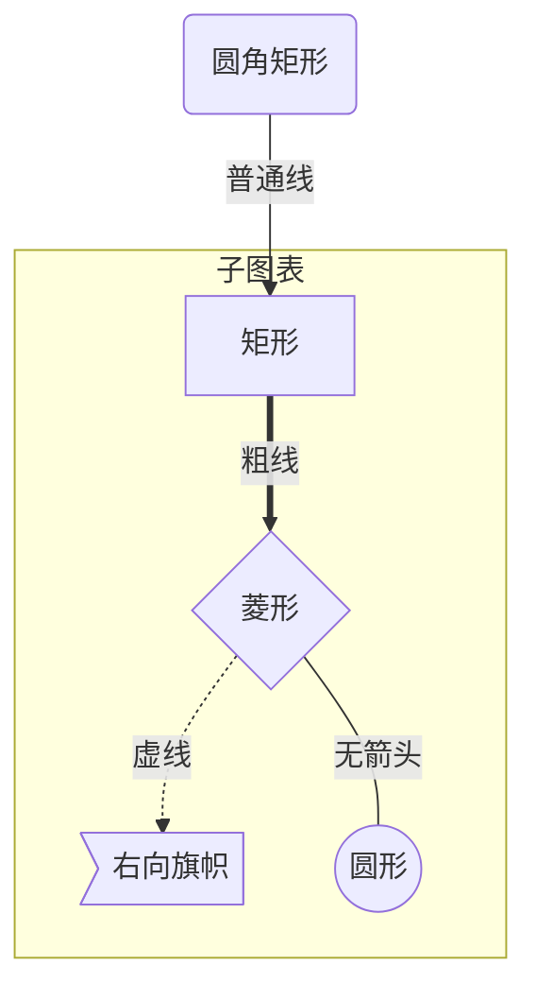
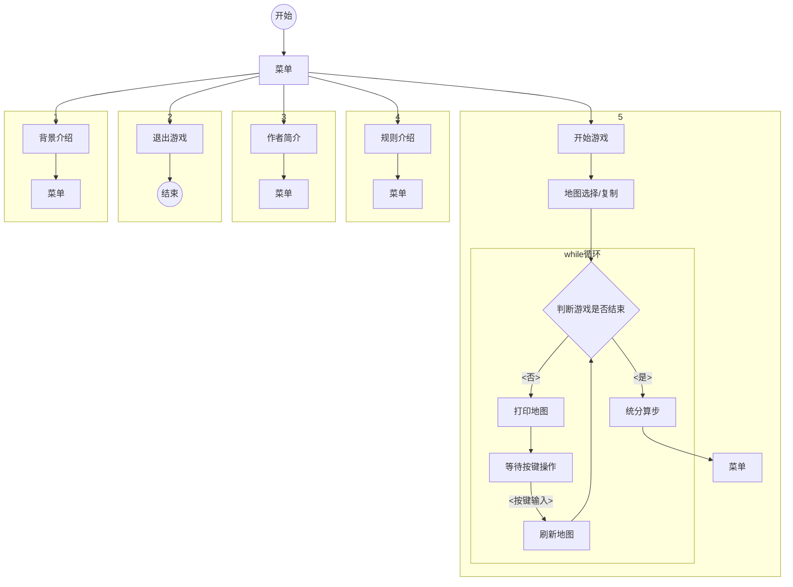

参考：https://blog.csdn.net/fenghuizhidao/article/details/79440583?ops_request_misc=%257B%2522request%255Fid%2522%253A%2522162597966716780265436723%2522%252C%2522scm%2522%253A%252220140713.130102334..%2522%257D&request_id=162597966716780265436723&biz_id=0&utm_medium=distribute.pc_search_result.none-task-blog-2~all~sobaiduend~default-3-79440583.first_rank_v2_pc_rank_v29&utm_term=mermaid%E8%AF%AD%E6%B3%95&spm=1018.2226.3001.4187

### 1.流程图

##### 1.图表方向

```
graph 方向描述
    图表中的其他语句...
```

其中方向描述如下：

| 用词 | 涵义     |
| ---- | -------- |
| TB   | 从上带下 |
| BT   | 从下到上 |
| RL   | 从右到左 |
| LR   | 从左到右 |

##### 2.节点定义

即流程图中每个文本块，包括开始、结束、处理、判断等。Mermaid 中每个节点都有一个 id，以及节点的文字。

| 表述         | 说明           |
| ------------ | -------------- |
| `id[文字]`   | 矩形节点       |
| `id(文字)`   | 圆角矩形节点   |
| `id((文字))` | 圆形节点       |
| `id>文字]`   | 右向旗帜状节点 |
| `id{文字}`   | 菱形节点       |

需要注意的是，如果节点的文字中包含标点符号，需要时用双引号包裹起来。 
另外如果希望在文字中使用换行，请使用 
替换换行

##### 3.节点间的连线

| 表述       | 说明           |
| ---------- | -------------- |
| `>`        | 添加尾部箭头   |
| `-`        | 不添加尾部箭头 |
| `--`       | 单线           |
| `--text--` | 单线上加文字   |
| `==`       | 粗线           |
| `==text==` | 粗线加文字     |
| `-.-`      | 虚线           |
| `-.text.-` | 虚线加文字     |

##### 4.子图表

使用以下语法添加子图表

```
subgraph 子图表名称
    子图表中的描述语句...
end
```

##### 5.样例





